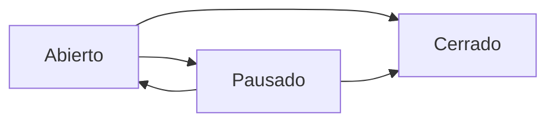

# Estados de Tickets

## Objetivo
Comprender los diferentes estados por los que pasa un ticket durante su ciclo de vida.

## Estados Principales

### 🟢 Abierto
**Descripción**: El ticket está activo y en proceso de resolución.

**Acciones disponibles**:
- Agregar comentarios
- Adjuntar archivos
- Cambiar asignación
- Pausar el ticket
- Cerrar el ticket (si está resuelto)

### 🟡 Pausado
**Descripción**: El ticket está temporalmente detenido.

**Razones comunes**:
- Esperando información del usuario
- Dependencia de un tercero
- Recursos no disponibles

**Acciones disponibles**:
- Reanudar el ticket
- Agregar comentarios explicando el motivo
- Cerrar el ticket

### ⚫ Cerrado
**Descripción**: El ticket ha sido resuelto y finalizado.

**Características**:
- No se pueden hacer cambios
- Se puede consultar el historial
- Puede reabrirse si es necesario (según permisos)

## Transiciones de Estado

## Indicadores Visuales

En la lista de tickets, cada estado tiene un color distintivo:

- **Verde**: Abierto - Ticket activo
- **Amarillo**: Pausado - Ticket en espera
- **Gris**: Cerrado - Ticket finalizado

## Permisos

Los cambios de estado requieren permisos específicos:

| Acción | Rol Requerido |
|--------|---------------|
| Pausar ticket | Agente asignado o Admin |
| Reanudar ticket | Agente asignado o Admin |
| Cerrar ticket | Agente asignado o Admin |
| Reabrir ticket | Administrador |

## Próximos Pasos

- [Crear un ticket](./crear-ticket.mdx)
- [Ver lista de tickets](./ver-tickets.mdx)
